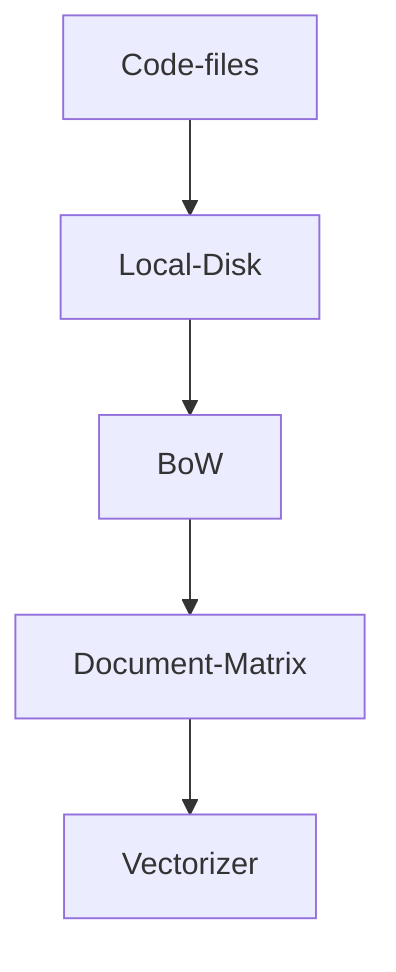
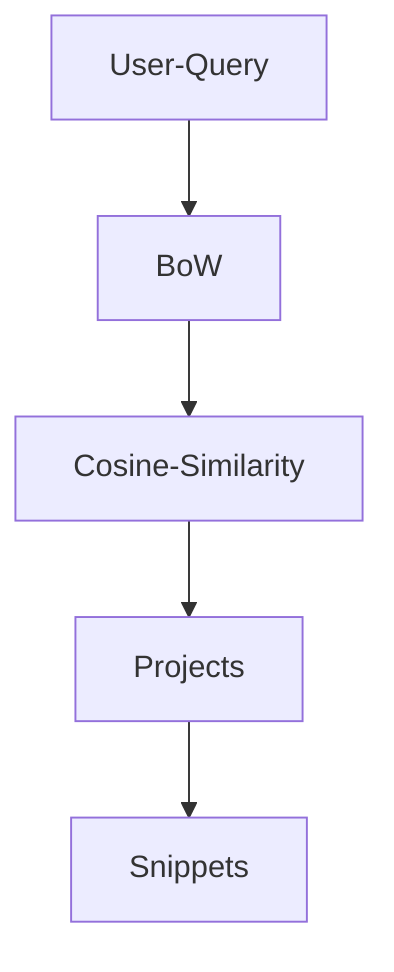

# discover-workshop
Code search utility using bag of words estimator.

## How it works

## Overview

### Fetch data from GitLab

BoW refers to Bag of Words model.

### Query against the data

Cosine Similarity is performed on the input vector (user query) and document matrix.

